## Part 1

- **Возьми официальный докер-образ с `nginx` и выкачай его при помощи `docker pull`.**
  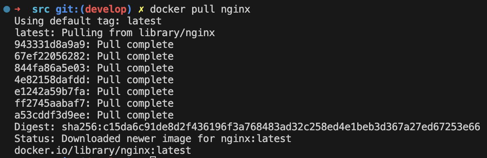
- **Проверь наличие докер-образа через `docker images`.**
  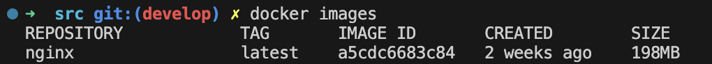
- **Запусти докер-образ через `docker run -d [image_id|repository]`.**
  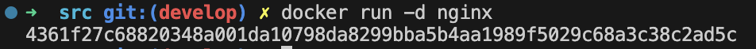
- **Проверь, что образ запустился через `docker ps`.**
  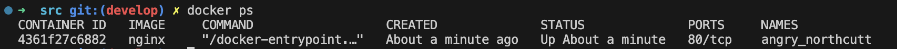
- **Посмотри информацию о контейнере через `docker inspect [container_id|container_name]`.**
  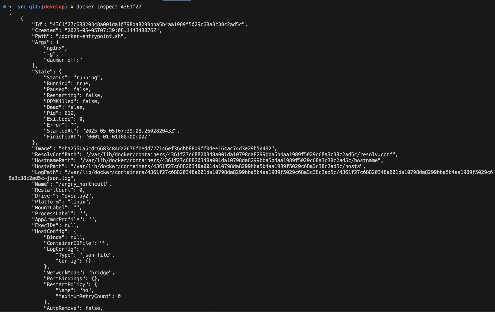
- **По выводу команды определи и помести в отчёт размер контейнера, список замапленных портов и ip контейнера.**
   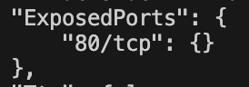 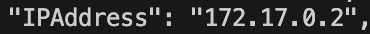
- **Останови докер контейнер через `docker stop [container_id|container_name]`.**
  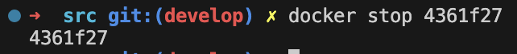
- **Проверь, что контейнер остановился через `docker ps`.**
  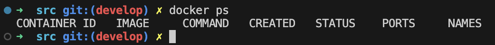
- **Запусти докер с портами `80` и `443` в контейнере, замапленными на такие же порты на локальной машине, через команду `run`.**
  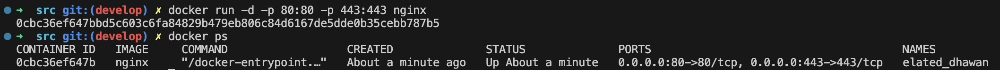
- **Проверь, что в браузере по адресу `localhost:80` доступна стартовая страница `nginx`.**
  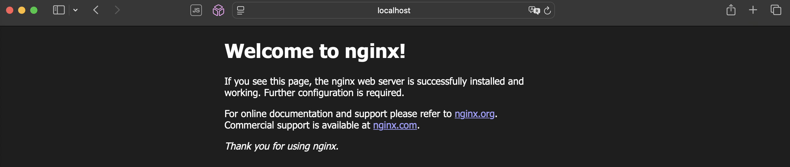
- **Перезапусти докер контейнер через docker `restart [container_id|container_name]`.**
  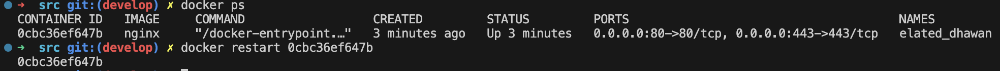
- **Проверь любым способом, что контейнер запустился.**
  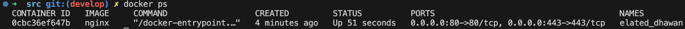

## Task 2

- **Прочитай конфигурационный файл `nginx.conf` внутри докер контейнера через команду `exec`.**
  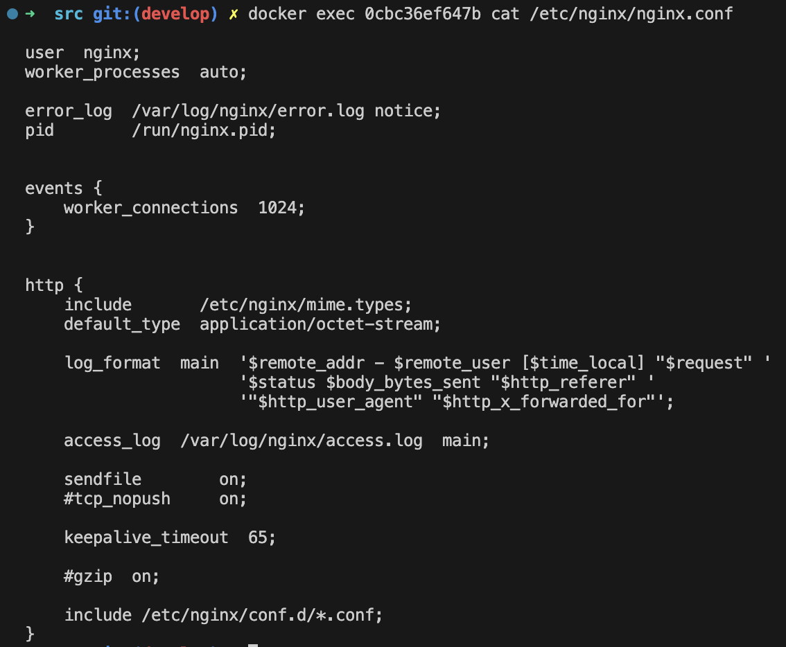
- **Создай на локальной машине файл `nginx.conf`.**
  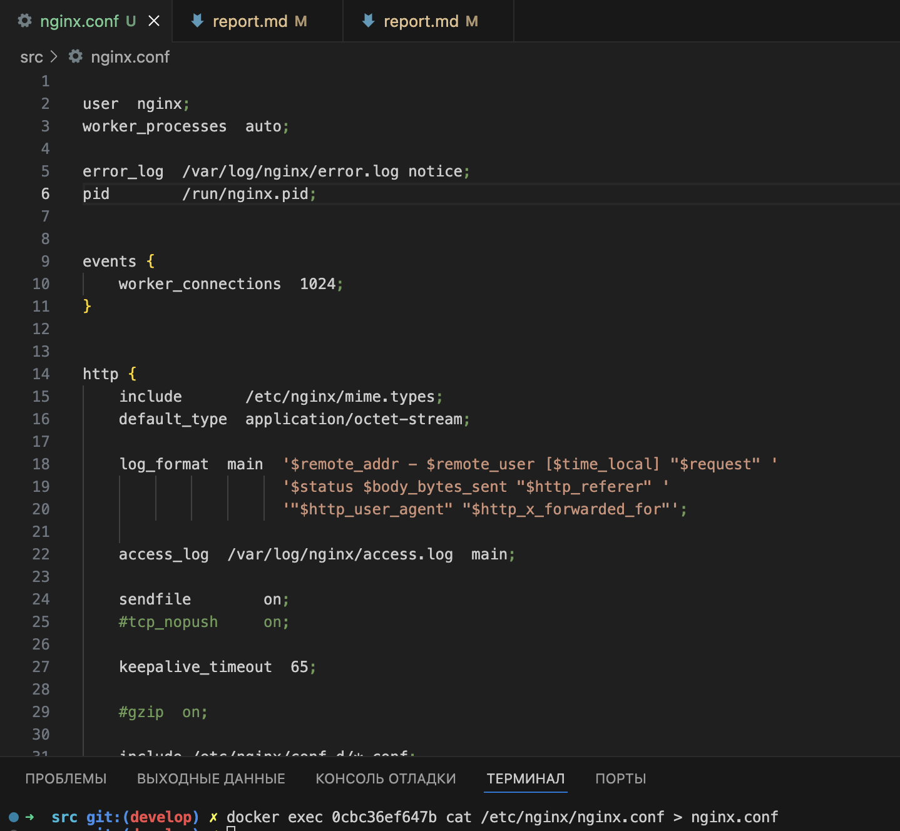
- **Настрой в нем по пути `/status` отдачу страницы статуса сервера `nginx`.**
  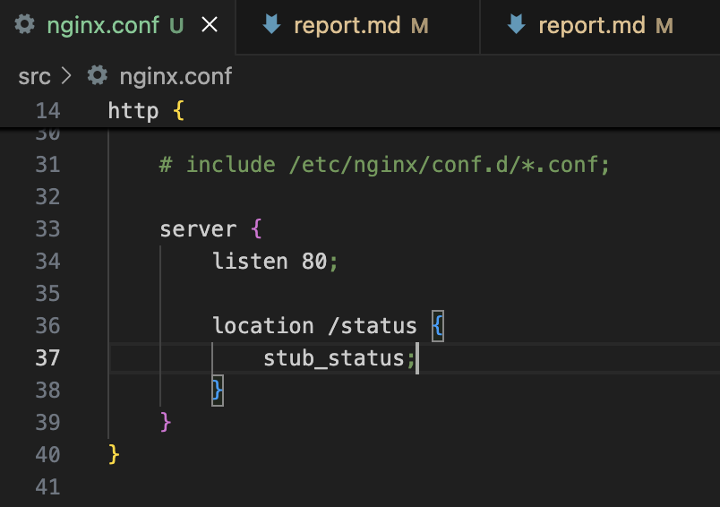
- **Скопируй созданный файл `nginx.conf` внутрь докер-образа через команду `docker cp`.**
  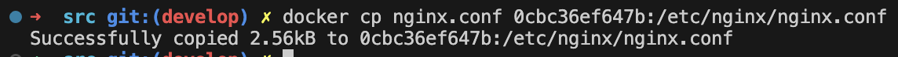
- **Перезапусти `nginx` внутри докер-образа через команду `exec`.**
  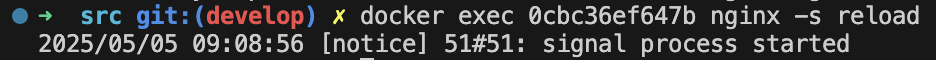
- **Проверь, что по адресу `localhost:80/status` отдается страничка со статусом сервера `nginx`.**
  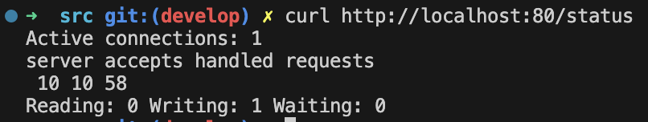
- **Экспортируй контейнер в файл `container.tar` через команду `export`.**
  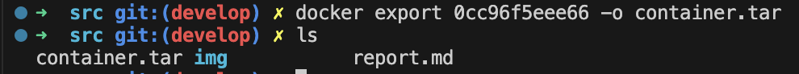
- **Останови контейнер.**
  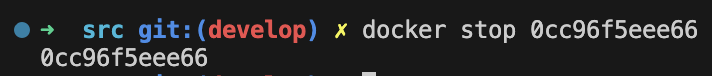
- **Удали остановленный контейнер.**
  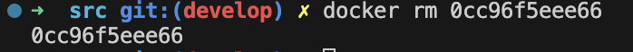
- **Удали образ через `docker rmi [image_id|repository]`, не удаляя перед этим контейнеры.**
  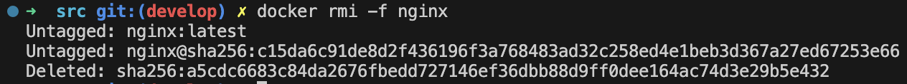
- **Импортируй контейнер обратно через команду `import`.**
  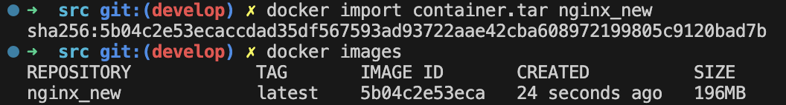
- **Запусти импортированный контейнер.**
  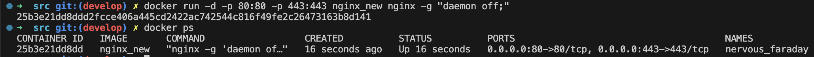
- **Проверь, что по адресу `localhost:80/status` отдается страничка со статусом сервера `nginx`.**
  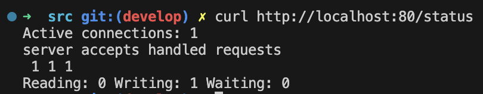

## Task 3

- **Напиши мини-сервер на `C` и `FastCgi`, который будет возвращать простейшую страничку с надписью `Hello, World!`.**
  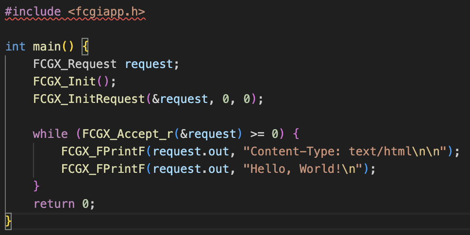

- **Запусти написанный мини-сервер через `spawn-fcgi` на порту `8080`.**
  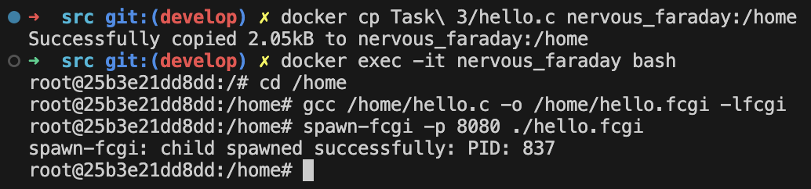

- **Напиши свой `nginx.conf`, который будет проксировать все запросы с `81` порта на `127.0.0.1:8080`.**
  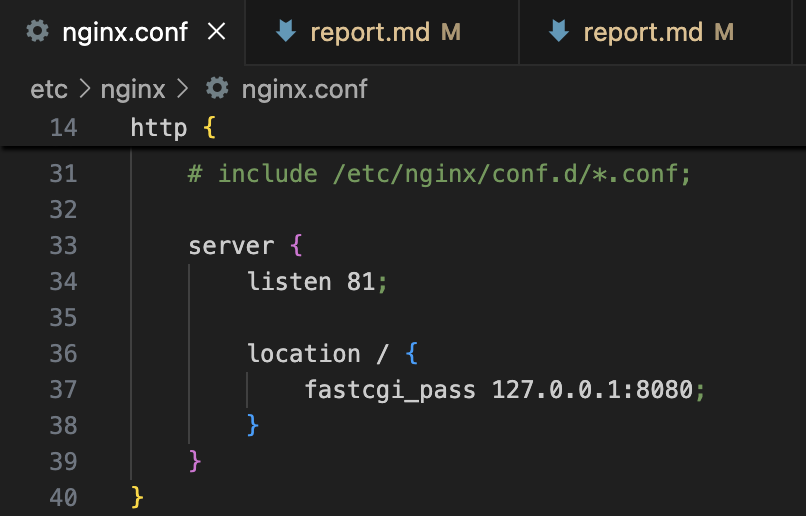

- **Проверь, что в браузере по `localhost:81` отдается написанная тобой страничка.**
  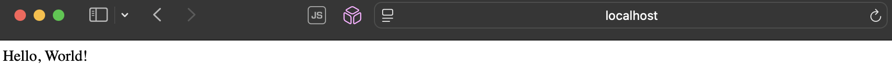

- **Положи файл nginx.conf по пути ./nginx/nginx.conf (это понадобится позже).**
  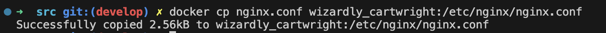

## Task 4

- **Напиши свой докер-образ, который:**
  1) собирает исходники мини сервера на FastCgi из Части 3;
  2) запускает его на 8080 порту;
  3) копирует внутрь образа написанный ./nginx/nginx.conf;
  4) запускает nginx.

  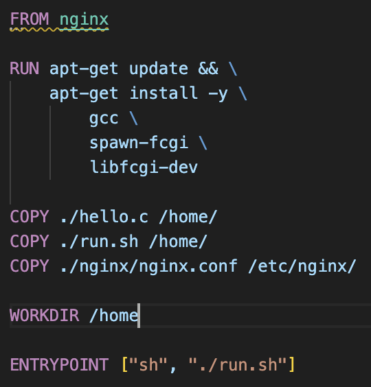

- **Собери написанный докер-образ через docker build при этом указав имя и тег.**
  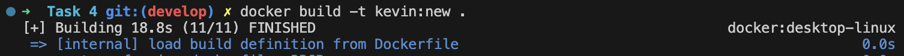

- **Проверь через docker images, что все собралось корректно.**
  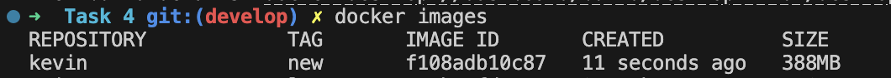

- **Запусти собранный докер-образ с маппингом 81 порта на 80 на локальной машине и маппингом папки ./nginx внутрь контейнера по адресу, где лежат конфигурационные файлы nginx'а (см. Часть 2).**
  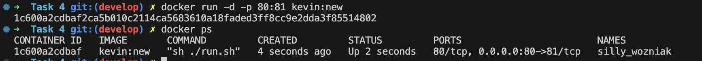

- **Проверь, что по localhost:80 доступна страничка написанного мини сервера.**
  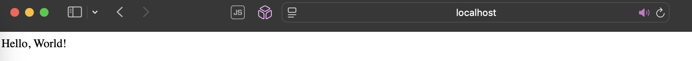

- **Допиши в ./nginx/nginx.conf проксирование странички /status, по которой надо отдавать статус сервера nginx.**
  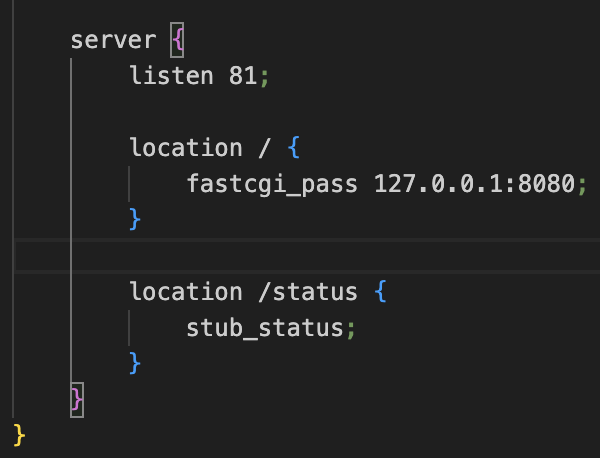

- **Пересобери докер-образ.**
  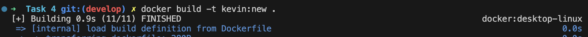

- **Проверь, что теперь по localhost:80/status отдается страничка со статусом nginx**
  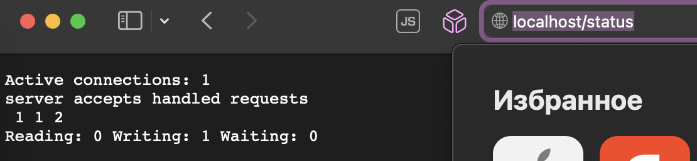

## Task 5

- **Просканируй образ из предыдущего задания через `dockle [image_id|repository]`.**
  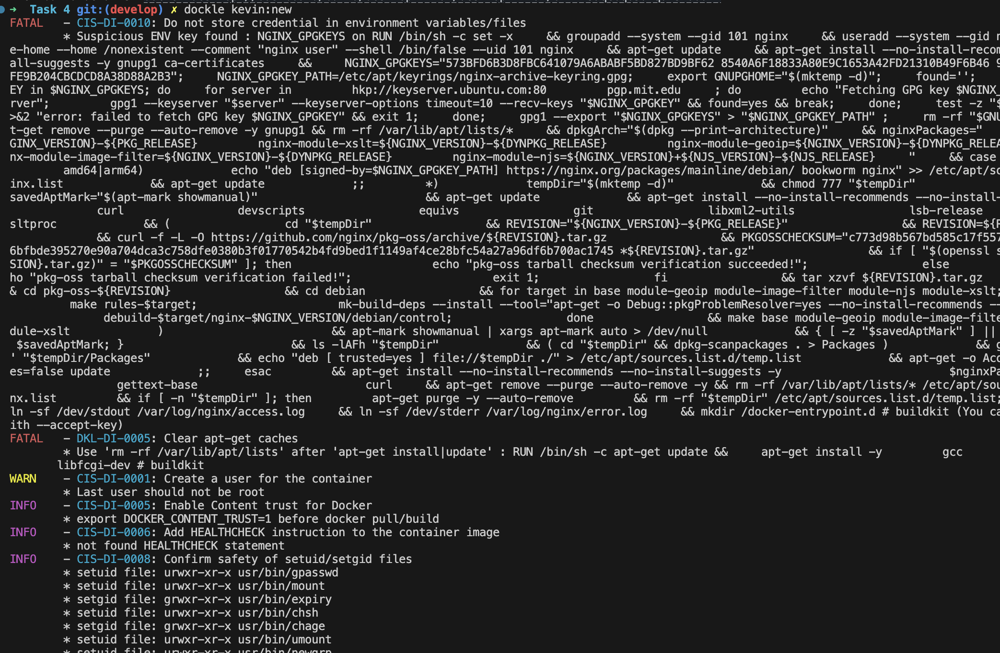

- **Исправь образ так, чтобы при проверке через `dockle` не было ошибок и предупреждений.**
  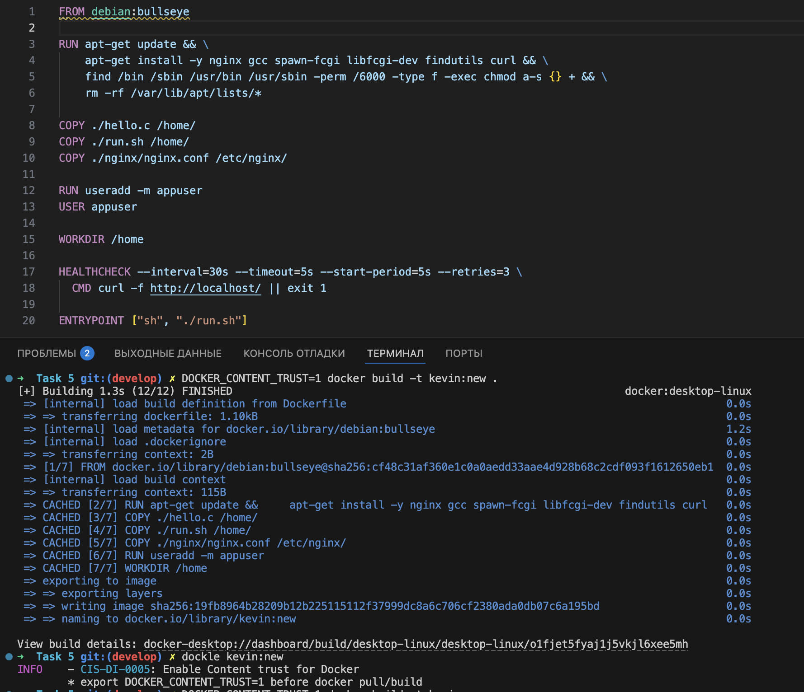

## Task 6

- **Напиши файл `docker-compose.yml`, с помощью которого:  1) Подними докер-контейнер из Части 5 (он должен работать в локальной сети, т. е. не нужно использовать инструкцию `EXPOSE` и мапить порты на локальную машину).  2) Подними докер-контейнер с `nginx`, который будет проксировать все запросы с `8080` порта на `81` порт первого контейнера.**
  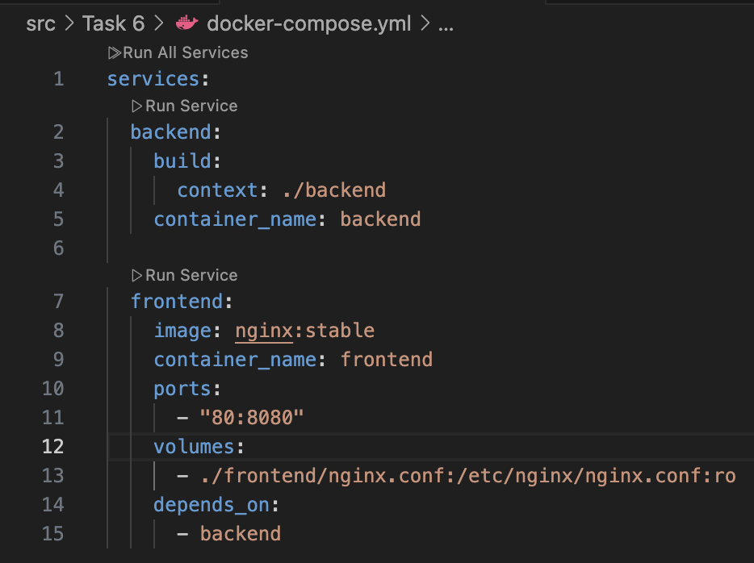

- **Замапь `8080` порт второго контейнера на `80` порт локальной машины.**
   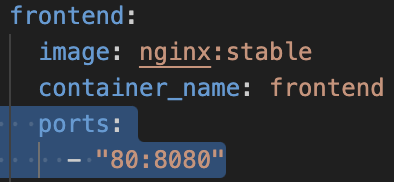

- **Останови все запущенные контейнеры.**
  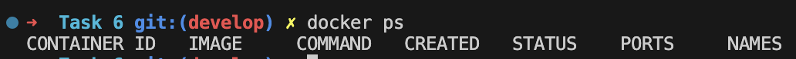

- **Собери и запусти проект с помощью команд `docker-compose build` и `docker-compose up`.**
  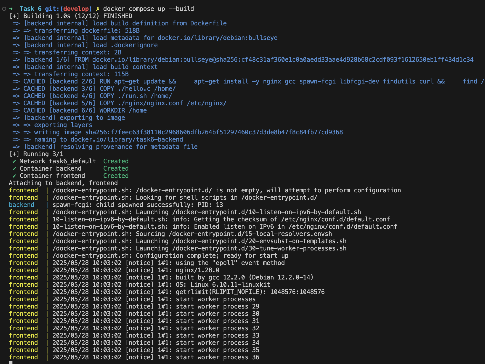

- **Проверь, что в браузере по `localhost:80` отдается написанная тобой страничка, как и ранее.**
  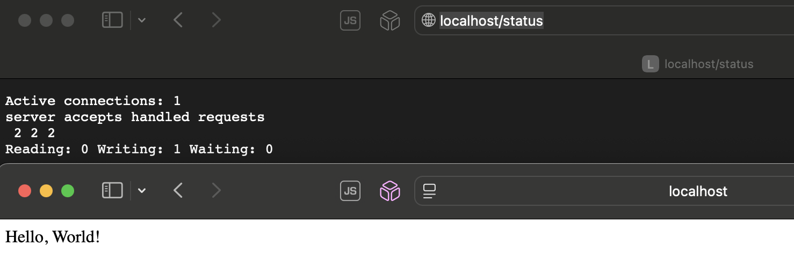